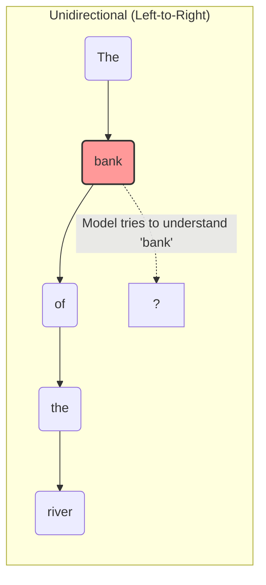
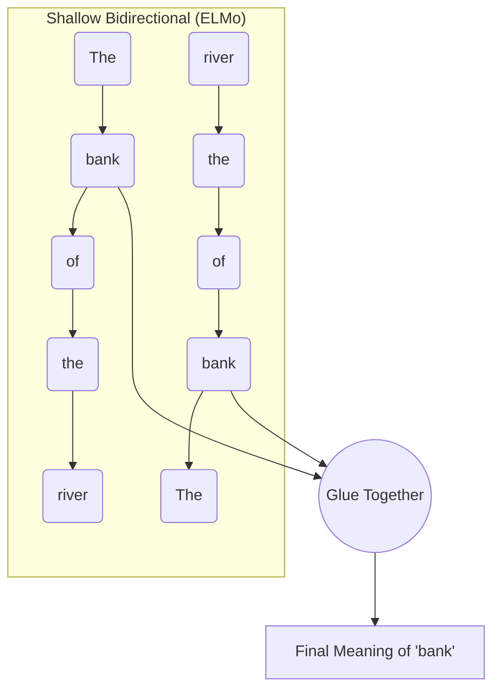
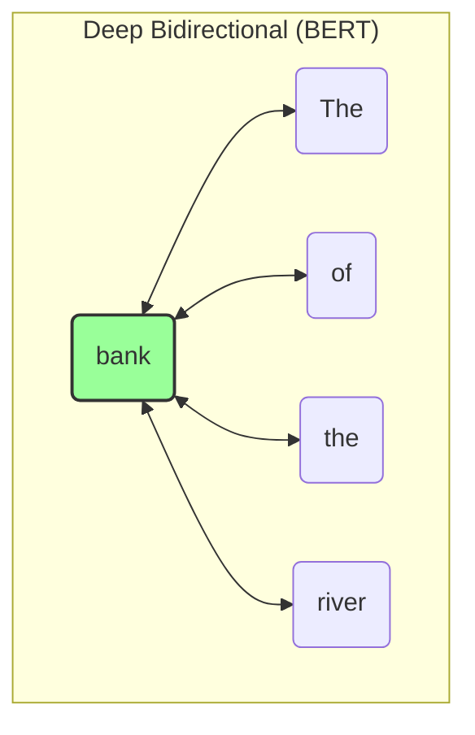
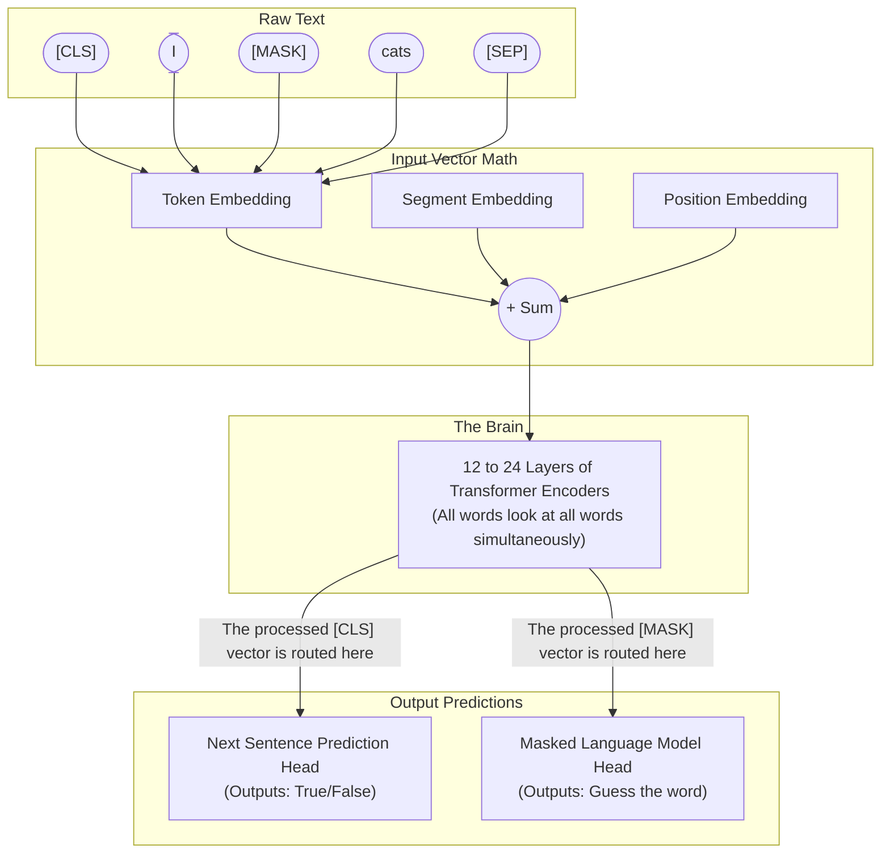

# BERT: Detailed Notes (Phases 1 & 2)

## Phase 1: High-Level Mental Model

### The Problem: The "Bank" Example
Imagine we have two sentences:
1. "I went to the **bank** to deposit money."
2. "I sat by the river **bank** to fish."

The word "**bank**" means completely different things depending on the words that come *after* it. Let's look at how the older models handled this compared to BERT.

#### 1. Unidirectional Models (Like OpenAI's original GPT)
Unidirectional models read text exactly like you read a book: strictly left-to-right. 



**The Flaw:** By the time the model has to process the word "bank", it *has* seen the word "river" (which helps). But what if the sentence was: *"The **bank** of the river is muddy."* In this case, when processing "bank", it only sees "The". It has zero idea what kind of bank it is until it reads further, but the internal representation for "bank" has already been calculated. It is blind to the future.

#### 2. Shallow Bidirectional Models (Like ELMo)
Scientists realized left-to-right wasn't enough, so they created models like ELMo. ELMo trains *two* separate models. One reads left-to-right, and the other reads right-to-left. Then, it just glues their answers together at the very end.



**The Flaw:** This is better, but it's "shallow." The left-reading brain and the right-reading brain never actually talk to each other while they are thinking. They only compare notes at the very end. 

#### 3. Deep Bidirectional Models (BERT)
BERT solves this by using the Transformer Encoder. In BERT, every single word looks at *every single other word* in the entire sentence simultaneously. There is no "left-to-right" or "right-to-left". It's all-at-once.



Here, when BERT calculates the meaning of "bank", the mathematical equation for "bank" is literally pulling context directly from "The", "of", "the", and "river" *all at the exact same time*.

---

### The Solution: Why Masking is Necessary

If BERT looks at everything all at once, why did the creators have to invent the **Masked Language Model (MLM)** (the fill-in-the-blank game)?

Because if you train a model to *predict the next word* (like standard models do), but you let it look at everything all at once, the model will just cheat!

**The Cheating Scenario (Without Masking):**
Imagine we ask a fully bidirectional model to predict the next word after "river". Since all words are looking at all words, the word "river" would look ahead to the next word, see what it is, and the model would just spit it out with 0 effort. It wouldn't learn English; it would just learn to copy-paste.

**The Real-World Analogy**
Imagine a teacher giving a student a reading comprehension test.
* **Left-to-Right:** The teacher covers the end of the sentence with a piece of paper: *"The cat sat on the [???]"*. The student has to think hard to guess the answer.
* **Bidirectional (Cheating):** The teacher gives the student the fully uncovered paper: *"The cat sat on the mat"*, points to the word "the", and asks, *"What is the next word?"* The student doesn't need to know how to read English. They just use their eyes, look one inch to the right, see the word "mat", and write it down. They score 100% on the test, but they learned absolutely nothing.

**The BERT Solution (With Masking):**
Instead of predicting the next word, BERT takes a sentence, hides a word, and forces the model to use the surrounding words to guess it.
**Example:** `The [MASK] of the river is muddy.`

Now, the model *must* look at "The", "of", "the", "river", "is", "muddy" to figure out that the `[MASK]` should probably be the word "bank". It cannot cheat because the word isn't there anymore! This forces BERT to learn incredibly deep definitions of words and grammar in order to win the fill-in-the-blank game.

---

## Phase 2: Core Methodology & Mathematics

### 1. Input Representation: The Three Embeddings

To understand *why* we need these three embeddings, you first have to understand a fundamental flaw of the Transformer: **It has no concept of time or sequence.** 

If you feed a sentence into a Transformer, it doesn't read it from left to right. It reads it like a giant "bag of words" all at the exact same time. Without embeddings, the Transformer would look at the sentence *"The dog bit the man"* and *"The man bit the dog"* and think they are exactly the same thing. 

To fix this, BERT has to attach "metadata" to every single word by adding three specific vectors (lists of 768 numbers) together:

1. **Token Embedding (The Core Meaning):** Think of the Token Embedding as a massive, mathematical dictionary. Every word (or sub-word) in BERT's vocabulary is assigned a unique ID. For example, let's say the word **"cats"** is ID `#4921`. BERT goes to its dictionary, looks up `#4921`, and pulls out a list of 768 floating-point numbers. These numbers represent the pure semantic meaning of the word (e.g., "animality", "fluffiness", "plurality").
2. **Segment Embedding (The Sentence Highlighter):** Because BERT trains on pairs of sentences for the Next Sentence Prediction task, it needs to know which words belong to Sentence A, and which belong to Sentence B. It adds a specific "A Vector" to "cats", which acts exactly like taking a yellow highlighter to Sentence A.
3. **Position Embedding (The GPS Coordinate):** BERT has a unique, learned vector for every single position in a sentence, from Position 0 up to Position 512. If the word "cats" is the 4th word in our sequence (Index 3), BERT grabs the **Position 3 Vector** and adds it to the word. This acts as a spatial GPS coordinate.

**Putting It All Together (The Addition)**
For the word **"cats"** located at position 3 in Sentence A, BERT literally adds the three vectors together using basic matrix addition:

`Final Input Vector = Token("cats") + Segment(A) + Position(3)`

In high-dimensional space (768 dimensions), adding vectors superimposes the information. The resulting vector simultaneously tells the neural network:
1. *"I am a plural feline"* **(Token)**
2. *"I am located in the first sentence"* **(Segment)**
3. *"I am the 4th word from the left"* **(Position)**

### 2. The Architecture Diagram

You can open the fully editable `.drawio` file I created for you here: `e:\AI Engineer\ResearchPapaer\notes\vectorization\bert\bert_architecture.drawio`



### 3. Mathematics to Code: The MLM Objective

Let's translate the rigorous math of the Masked Language Model (MLM) into explicit PyTorch pseudo-code. 

In a standard model, you calculate your error (loss) on every single word as it predicts the next one. In BERT, **you only calculate the error on the masked tokens.**

Imagine our input sequence is: `[CLS] I [MASK] cats [SEP]`. 
The true hidden word is **"love"** (Let's say "love" is word `#405` in our dictionary). 
The `[MASK]` token is located at **Index 2**.

```python
import torch
import torch.nn as nn

# 1. Push the text through BERT's layers
# input_ids contains the numbers for: [CLS] I [MASK] cats [SEP]
sequence_output = bert_encoder(input_ids) 
# The output is a giant matrix containing a 768-dimension vector for EVERY word.

# 2. Extract ONLY the vector for the [MASK] token
# We know [MASK] is at index 2. We throw away the outputs for the other words!
mask_position = 2
masked_vector = sequence_output[0, mask_position, :] # Shape: (768 numbers)

# 3. Project that vector against the entire English dictionary (e.g., 30,000 words)
# This gives a probability score for every possible word it could be.
dictionary_scores = mlm_prediction_head(masked_vector) # Shape: (30,000 numbers)

# 4. Compute the Error (Cross Entropy Loss)
# We tell the computer: "The correct answer was word #405 ('love'). How far off was your guess?"
loss_function = nn.CrossEntropyLoss()
true_label = torch.tensor([405]) 

loss = loss_function(dictionary_scores.unsqueeze(0), true_label)

# 5. The model updates its brain to get closer to the word 'love' next time.
loss.backward()
```

**The Beauty of the Attention Mechanism here:**
When the `bert_encoder` runs, the math inside allows the vector at Index 2 (`[MASK]`) to literally absorb the meaning of Index 1 ("I") and Index 3 ("cats"). By looking at "I" and "cats", the internal vector at Index 2 molds itself into a mathematical representation of *"a verb that a human does to an animal"*. The `mlm_prediction_head` then easily translates that mathematical shape into the word "love".
