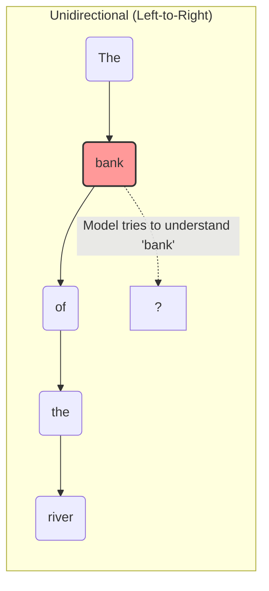
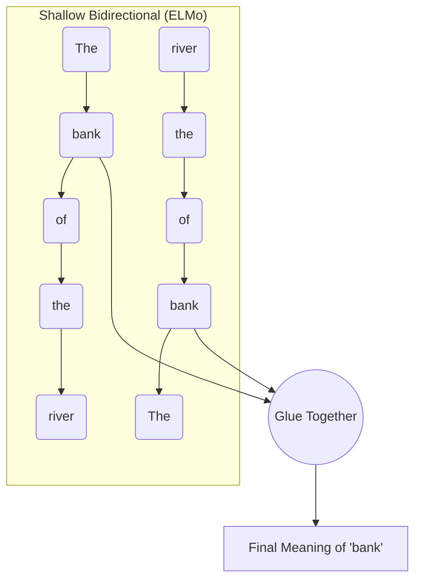
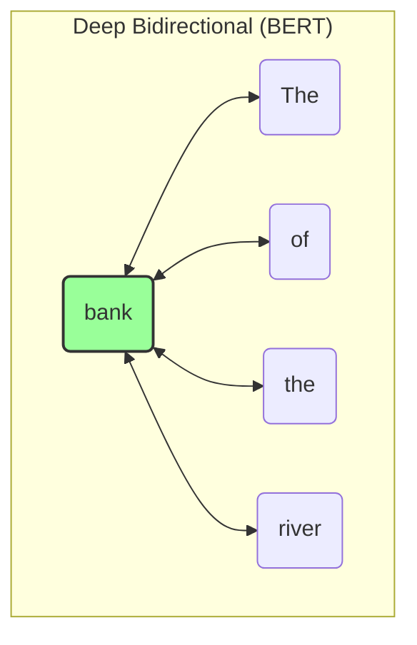

# BERT: Detailed Notes (Phases 1 & 2)

## Phase 1: High-Level Mental Model

### The Problem: The "Bank" Example
Imagine we have two sentences:
1. "I went to the **bank** to deposit money."
2. "I sat by the river **bank** to fish."

The word "**bank**" means completely different things depending on the words that come *after* it. Let's look at how the older models handled this compared to BERT.

#### 1. Unidirectional Models (Like OpenAI's original GPT)
Unidirectional models read text exactly like you read a book: strictly left-to-right. 



**The Flaw:** By the time the model has to process the word "bank", it *has* seen the word "river" (which helps). But what if the sentence was: *"The **bank** of the river is muddy."* In this case, when processing "bank", it only sees "The". It has zero idea what kind of bank it is until it reads further, but the internal representation for "bank" has already been calculated. It is blind to the future.

#### 2. Shallow Bidirectional Models (Like ELMo)
Scientists realized left-to-right wasn't enough, so they created models like ELMo. ELMo trains *two* separate models. One reads left-to-right, and the other reads right-to-left. Then, it just glues their answers together at the very end.



**The Flaw:** This is better, but it's "shallow." The left-reading brain and the right-reading brain never actually talk to each other while they are thinking. They only compare notes at the very end. 

#### 3. Deep Bidirectional Models (BERT)
BERT solves this by using the Transformer Encoder. In BERT, every single word looks at *every single other word* in the entire sentence simultaneously. There is no "left-to-right" or "right-to-left". It's all-at-once.



Here, when BERT calculates the meaning of "bank", the mathematical equation for "bank" is literally pulling context directly from "The", "of", "the", and "river" *all at the exact same time*.

---

### The Solution: Why Masking is Necessary

If BERT looks at everything all at once, why did the creators have to invent the **Masked Language Model (MLM)** (the fill-in-the-blank game)?

Because if you train a model to *predict the next word* (like standard models do), but you let it look at everything all at once, the model will just cheat!

**The Cheating Scenario (Without Masking):**
Imagine we ask a fully bidirectional model to predict the next word after "river". Since all words are looking at all words, the word "river" would look ahead to the next word, see what it is, and the model would just spit it out with 0 effort. It wouldn't learn English; it would just learn to copy-paste.

**The Real-World Analogy**
Imagine a teacher giving a student a reading comprehension test.
* **Left-to-Right:** The teacher covers the end of the sentence with a piece of paper: *"The cat sat on the [???]"*. The student has to think hard to guess the answer.
* **Bidirectional (Cheating):** The teacher gives the student the fully uncovered paper: *"The cat sat on the mat"*, points to the word "the", and asks, *"What is the next word?"* The student doesn't need to know how to read English. They just use their eyes, look one inch to the right, see the word "mat", and write it down. They score 100% on the test, but they learned absolutely nothing.

**The BERT Solution (With Masking):**
Instead of predicting the next word, BERT takes a sentence, hides a word, and forces the model to use the surrounding words to guess it.
**Example:** `The [MASK] of the river is muddy.`

Now, the model *must* look at "The", "of", "the", "river", "is", "muddy" to figure out that the `[MASK]` should probably be the word "bank". It cannot cheat because the word isn't there anymore! This forces BERT to learn incredibly deep definitions of words and grammar in order to win the fill-in-the-blank game.

---

## Phase 2: Core Methodology & Mathematics

### 1. Input Representation: The Three Embeddings

To understand *why* we need these three embeddings, you first have to understand a fundamental flaw of the Transformer: **It has no concept of time or sequence.** 

If you feed a sentence into a Transformer, it doesn't read it from left to right. It reads it like a giant "bag of words" all at the exact same time. Without embeddings, the Transformer would look at the sentence *"The dog bit the man"* and *"The man bit the dog"* and think they are exactly the same thing. 

To fix this, BERT has to attach "metadata" to every single word by adding three specific vectors (lists of 768 numbers) together:

1. **Token Embedding (The Core Meaning):** Think of the Token Embedding as a massive, mathematical dictionary. Every word (or sub-word) in BERT's vocabulary is assigned a unique ID. For example, let's say the word **"cats"** is ID `#4921`. BERT goes to its dictionary, looks up `#4921`, and pulls out a list of 768 floating-point numbers. These numbers represent the pure semantic meaning of the word (e.g., "animality", "fluffiness", "plurality").
2. **Segment Embedding (The Sentence Highlighter):** Because BERT trains on pairs of sentences for the Next Sentence Prediction task, it needs to know which words belong to Sentence A, and which belong to Sentence B. It adds a specific "A Vector" to "cats", which acts exactly like taking a yellow highlighter to Sentence A.
3. **Position Embedding (The GPS Coordinate):** BERT has a unique, learned vector for every single position in a sentence, from Position 0 up to Position 512. If the word "cats" is the 4th word in our sequence (Index 3), BERT grabs the **Position 3 Vector** and adds it to the word. This acts as a spatial GPS coordinate.

**Putting It All Together (The Addition)**
For the word **"cats"** located at position 3 in Sentence A, BERT literally adds the three vectors together using basic matrix addition:

`Final Input Vector = Token("cats") + Segment(A) + Position(3)`

In high-dimensional space (768 dimensions), adding vectors superimposes the information. The resulting vector simultaneously tells the neural network:
1. *"I am a plural feline"* **(Token)**
2. *"I am located in the first sentence"* **(Segment)**
3. *"I am the 4th word from the left"* **(Position)**

### 2. The Architecture Diagram

You can open the fully editable `.drawio` file I created for you here: `e:\AI Engineer\ResearchPapaer\notes\vectorization\bert\bert_architecture.drawio`


### 3. Mathematics to Code: The MLM Objective

Let's translate the rigorous math of the Masked Language Model (MLM) into explicit PyTorch pseudo-code. 

In a standard model, you calculate your error (loss) on every single word as it predicts the next one. In BERT, **you only calculate the error on the masked tokens.**

Imagine our input sequence is: `[CLS] I [MASK] cats [SEP]`. 
The true hidden word is **"love"** (Let's say "love" is word `#405` in our dictionary). 
The `[MASK]` token is located at **Index 2**.

```python
import torch
import torch.nn as nn

# 1. Push the text through BERT's layers
# input_ids contains the numbers for: [CLS] I [MASK] cats [SEP]
sequence_output = bert_encoder(input_ids) 
# The output is a giant matrix containing a 768-dimension vector for EVERY word.

# 2. Extract ONLY the vector for the [MASK] token
# We know [MASK] is at index 2. We throw away the outputs for the other words!
mask_position = 2
masked_vector = sequence_output[0, mask_position, :] # Shape: (768 numbers)

# 3. Project that vector against the entire English dictionary (e.g., 30,000 words)
# This gives a probability score for every possible word it could be.
dictionary_scores = mlm_prediction_head(masked_vector) # Shape: (30,000 numbers)

# 4. Compute the Error (Cross Entropy Loss)
# We tell the computer: "The correct answer was word #405 ('love'). How far off was your guess?"
loss_function = nn.CrossEntropyLoss()
true_label = torch.tensor([405]) 

loss = loss_function(dictionary_scores.unsqueeze(0), true_label)

# 5. The model updates its brain to get closer to the word 'love' next time.
loss.backward()
```

**The Beauty of the Attention Mechanism here:**
When the `bert_encoder` runs, the math inside allows the vector at Index 2 (`[MASK]`) to literally absorb the meaning of Index 1 ("I") and Index 3 ("cats"). By looking at "I" and "cats", the internal vector at Index 2 molds itself into a mathematical representation of *"a verb that a human does to an animal"*. The `mlm_prediction_head` then easily translates that mathematical shape into the word "love".

---

## Phase 3: The Data Pipeline (The Secret Sauce)

Welcome to Phase 3! Now we're getting into the actual engine of the model: the data it was trained on. In modern AI engineering, the model architecture often matters less than the quality, scale, and curation of the dataset. Let's dissect how the authors of BERT handled their data pipeline.

### 1. The Anatomy of the Corpus (What are they actually learning?)

BERT is trained on 3.3 billion words. But the *composition* of those words dictates exactly what the model "knows" and how it "thinks." 

*   **BooksCorpus (800 Million Words):**
    *   **What it actually is:** This is a dataset of over 11,000 unpublished books scraped from smashwords.com. 
    *   **The Content Distribution:** It is heavily skewed towards Romance, Fantasy, Science Fiction, and Teen fiction. 
    *   **Engineering Implication:** Books provide deep, long-range narrative structures. A book has characters, ongoing plots, and conversational dialogue. This is critical for BERT to learn *coreference resolution* (knowing that "he" refers to "John" from three paragraphs ago) and long-term logical consistency.
*   **English Wikipedia (2,500 Million Words):**
    *   **What it actually is:** Encyclopedic, formal, highly structured factual data. 
    *   **The Processing Rule:** The authors explicitly state they extracted *only the text passages* and ignored lists, tables, and headers.
    *   **Engineering Implication:** Wikipedia teaches the model facts, formal grammar, and entity relationships (e.g., "Paris is the capital of France"). However, because they stripped out tables and lists, BERT inherently struggles with structured data formats out-of-the-box. 

**The Synergistic Mixture:** The ratio is roughly 75% Wikipedia (factual/formal) and 25% BooksCorpus (narrative/conversational). This mixture is the hidden reason BERT performs so well on both factual Q&A (SQuAD) and natural language inference (MNLI).

### 2. Document-Level vs. Sentence-Level Corpora

The authors state: *"It is critical to use a document-level corpus rather than a shuffled sentence-level corpus such as the Billion Word Benchmark."*

If you use a **sentence-level corpus** (where every line in your text file is a random sentence from the internet), your pipeline looks like this:
1. "The cat sat on the mat."
2. "Tesla stock rose 5% today."
If you feed this to BERT for the **Next Sentence Prediction (NSP)** task, it will learn nothing about how language flows, because there is no logical connection between sentence 1 and 2. 

By using a **document-level corpus** (keeping entire Wikipedia articles intact), the pipeline can extract two sentences that actually occurred sequentially in human writing. This is the *only* way the model can learn discourse, narrative flow, and complex reasoning. 

### 3. The Sequence Generation Pipeline (How raw text becomes Tensors)

This is the exact sequence of operations their data pipeline executes before a single gradient is calculated. 

#### Step 1: Raw Text Ingestion and Sentence Splitting
Before anything else, the pipeline reads a massive `.txt` file (e.g., a Wikipedia article).
*   **Raw Input:** `"The quick brown fox jumps over the lazy dog. He is a very energetic boy!"`
*   **Action:** The data loader uses a heuristic sentence splitter to break the document into a list of continuous spans of text.
*   **Result:** 
    *   `Span 1:` `"The quick brown fox jumps over the lazy dog."`
    *   `Span 2:` `"He is a very energetic boy!"`

#### Step 3: WordPiece Tokenization (The Sub-word Engine)
Deep learning models cannot read strings; they read numbers. Furthermore, the English language has millions of words, and keeping a vocabulary of millions of words would crash the GPU's memory.
BERT uses **WordPiece**, which has a fixed vocabulary of exactly **30,000 tokens**.

*   **Action:** The tokenizer scans every word. If a word is common (like `"fox"`), it gets mapped to a single token ID. If a word is rare or complex (like `"energetic"`), the tokenizer aggressively breaks it down into sub-words until it finds pieces that exist in its 30,000-word dictionary. Sub-words are prefixed with `##` to tell the model they are fragments attached to the previous word.
*   **Resulting Tokens:** `["the", "quick", "brown", "fox", "jumps", "over", "the", "lazy", "dog", ".", "he", "is", "a", "very", "en", "##er", "##getic", "boy", "!"]`

Notice how `"energetic"` was shattered into `["en", "##er", "##getic"]`. This is brilliant engineering: it allows BERT to handle completely made-up words or typos by breaking them down into phonetic chunks it recognizes.

#### Step 4: Sequence Assembly & The 50/50 Coin Flip (NSP)
Now the pipeline must assemble the `Sequence A` and `Sequence B` for the Next Sentence Prediction (NSP) task.
*   **Action:** The code pulls `Span 1` and makes it `Sequence A`.
*   **The Coin Flip:** A random number generator rolls. 
    *   **Heads (50%):** It selects `Span 2` (the actual chronological next sentence) as `Sequence B`. The label for this batch is set to `IsNext = 1`.
    *   **Tails (50%):** It ignores `Span 2`, reaches into a completely different Wikipedia article, and grabs a random span. The label for this batch is set to `NotNext = 0`.

#### Step 5: Injecting Special Tokens and Truncation
The Transformer architecture has no concept of "where a sentence begins or ends." We have to explicitly mark boundaries using special reserved tokens.
*   **Action:** We prepend `[CLS]` (Classification) to the very front. We append `[SEP]` (Separator) to the end of Sequence A, and another `[SEP]` to the end of Sequence B.
*   **Resulting Assembly:**
    `[CLS]` The quick brown fox... `[SEP]` He is a very en ##er ##getic boy ! `[SEP]`
*   **The Truncation Rule:** BERT is strictly limited to 512 tokens per sequence because self-attention memory scales quadratically. If the assembled sequence has 600 tokens, the pipeline ruthlessly chops off the end of the sequence until the total count is exactly 512.

#### Step 6: The Dynamic Masking Engine (The 15% Rule)
This is where the magic of the Masked Language Model (MLM) happens. The pipeline iterates over the assembled sequence to create the targets for the model to predict.

*   **Action:** For every single token (excluding `[CLS]` and `[SEP]`), there is a 15% chance it gets flagged for prediction. Let's say the token `"fox"` is flagged.
*   **The 80-10-10 Split:** Once `"fox"` is flagged, another random roll determines its fate:
    1.  **80% of the time:** The string `"fox"` is deleted and replaced with the literal string `"[MASK]"`.
    2.  **10% of the time:** The string `"fox"` is replaced with a completely random word from the dictionary (e.g., `"apple"`). This forces the model to double-check its inputs and not blindly trust the text.
    3.  **10% of the time:** The string `"fox"` is left exactly as it is (unchanged).

The pipeline records the original word (`"fox"`) and its index position so the loss function can score the model later.

#### Step 7: Numerical Mapping and Padding
The strings are finally converted into their integer IDs using the WordPiece dictionary.
*   `[CLS]` -> `101`
*   `the` -> `1996`
*   `[MASK]` -> `103`
*   `[SEP]` -> `102`

If our sequence only has 25 tokens, but our batch requires a uniform size (e.g., length 128 or 512), the pipeline appends `[PAD]` tokens (ID `0`) to the end until it hits the required length.

#### Step 8: Generating the 3 Final Tensors
The GPU does not take a single array. The data loader outputs exactly **three distinct PyTorch/TensorFlow Tensors** to feed into the BERT model.

1.  **The Input IDs Tensor:**
    This is the actual array of integers representing the words, the masks, and the padding.
    `[101, 1996, 4248, 2829, 103, ... 102, 2002, ... 102, 0, 0, 0]`

2.  **The Segment IDs Tensor:**
    Because all the text is mushed together in one array, the model needs to know which tokens belong to Sequence A and which belong to Sequence B. 
    This tensor is simply an array of `0`s and `1`s. `0` means "Sentence A". `1` means "Sentence B". Padding gets `0`.
    `[0, 0, 0, 0, 0, ... 0, 1, ... 1, 0, 0, 0]`

3.  **The Attention Mask Tensor:**
    The model should not apply mathematical attention to `[PAD]` tokens, as they are empty space. This tensor is an array of `1`s (real words/masks) and `0`s (padding).
    `[1, 1, 1, 1, 1, ... 1, 1, ... 1, 0, 0, 0]`

*(Behind the scenes inside the model architecture, a 4th tensor called **Position Embeddings** is automatically generated, counting from 0 to 511, so the model knows the physical order of the words).*

### 4. The Unforgivable Sins of the BERT Data Pipeline

As engineers evaluating this in the modern day, we must tear apart what they *didn't* do. Here is what is entirely missing from their methodology:

*   **Zero Deduplication:** There is no mention of MinHash or Exact Match deduplication. Wikipedia has thousands of duplicated paragraphs (templates, boilerplates). BooksCorpus has multiple editions of the same book. **Consequence:** BERT almost certainly memorized duplicate sequences, wasting expensive TPU compute cycles on redundant data instead of learning new concepts. Furthermore, it risks "test set leakage" if quotes from GLUE/SQuAD benchmarks existed in the training books.
*   **Zero Toxicity/Bias Filtering:** They just fed the model raw, unpublished internet romance and sci-fi books. There was no heuristic filtering for hate speech, extreme bias, or NSFW content. **Consequence:** The raw BERT model has deeply embedded gender and racial biases, mapping certain professions to specific genders based purely on the tropes present in the 11,000 unpublished novels.
*   **Zero Quality Heuristics:** Modern pipelines use classifiers to score the "quality" of text, dropping texts with too much punctuation, weird character encodings, or gibberish. BERT seemingly accepted whatever text was in the passage.

---

## Phase 4: Real-World Impact & Deep Technical Dive

Welcome to Phase 4. We are stepping away from the 2018 paper and looking at how the shockwaves of BERT actually shaped the multi-billion dollar AI industry we live in today. 

### 1. The Real-World Impact: The "Vector Search" Revolution

Before BERT (pre-2018), search engines used **Lexical Search** (algorithms like TF-IDF or BM25). Lexical search is basically a fancy `CTRL+F`. It looks for exact keyword matches.

*   **The Lexical Failure:** Imagine you query a database with: *"How much cash do I need to own a piece of the company that makes iPhones?"*
*   A lexical search engine looks for documents containing the words "cash", "piece", and "iPhones". It completely fails to find the Wikipedia article titled *"Apple Inc. Stock Price (AAPL)"* because none of the keywords match.

**The BERT Paradigm Shift (Semantic Search):**
BERT changed everything because it takes a sentence and squashes it down into a single `[CLS]` token containing 768 floating-point numbers. This is called a **Dense Vector Embedding**.

1.  You pass your query through BERT: *"How much cash do I need..."* -> BERT outputs Vector $Q$ `[0.12, -0.45, ... 0.99]`.
2.  In your database (like Pinecone or Weaviate), you already used BERT to calculate the vector for every Wikipedia article. The article *"Apple Inc. Stock Price"* is stored as Vector $D$ `[0.13, -0.42, ... 0.97]`.
3.  **The Math:** The search engine doesn't look at words. It uses a mathematical formula called **Cosine Similarity** to calculate the physical distance between Vector $Q$ and Vector $D$ in a 768-dimensional space. 
4.  Because BERT understood the *meaning* of the query, it mapped Vector $Q$ directly next to Vector $D$. The search engine returns the Apple stock page instantly.

**Real-World Example:** This exact architecture is how Spotify recommends songs that "feel" similar, how Google finds answers to obscurely worded questions, and how modern RAG (Retrieval-Augmented Generation) applications fetch private company PDFs to give to an AI.

### 2. Deep Technical Dive: Why ChatGPT isn't Bidirectional

If BERT's bidirectional architecture is so incredibly smart, why did OpenAI build ChatGPT using a "dumb" Left-to-Right (unidirectional) architecture?

**The Autoregressive Bottleneck (Why BERT can't write):**
Imagine we force an AI to write a 4-word sentence: *"The quick brown fox"*.

**How GPT (Left-to-Right) writes it:**
1.  Input: `[START]` -> Output: `The`
2.  Input: `The` -> Output: `quick`
3.  Input: `The quick` -> Output: `brown`
4.  Input: `The quick brown` -> Output: `fox`
*Engineering Trick:* GPT uses something called a **KV-Cache**. In Step 4, it doesn't need to recalculate the math for "The quick brown". It cached those thoughts in its RAM. It only does the math for the newest word. It is blazingly fast.

**How BERT (Bidirectional) would have to write it:**
Because BERT requires *every word to look at every other word simultaneously*, it cannot use a KV-Cache. 
1.  Input: `[MASK]` -> Output: `The`
2.  Input: `The [MASK]` -> Output: `quick` *(But to do this, it has to recalculate the math for "The" all over again, because "The" is now looking to its right at the new mask!)*
3.  Input: `The quick [MASK]` -> Output: `brown` *(It must recalculate "The" and "quick" from scratch).*
4.  Input: `The quick brown [MASK]` -> Output: `fox` *(It recalculates the whole sentence).*

If you asked BERT to write a 500-word essay, the amount of redundant math it would have to do would melt your GPU. 
**The Lesson:** You use Bidirectional Encoders (BERT) when you need to **read and understand** existing text. You use Unidirectional Decoders (GPT) when you need to **generate** new text fast.

### 3. Misconception Busting: The Legal AI Example

**The Myth:** *"I want to build an AI agent, so I will just send all my company's data to GPT-4."*
**The Reality:** GPT-4 has a limited context window and is extremely expensive. You cannot send 500,000 legal contracts to GPT-4 every time you ask a question. 

If you are an engineer building a Legal AI, you *must* use both architectures in harmony:

*   **Task A (The BERT Job):** A lawyer asks, *"Find me instances of intellectual property theft by former executives."* You use a fine-tuned BERT model to convert this query into a vector, search your Vector Database of 500,000 contracts, and retrieve the top 3 most relevant paragraphs in 50 milliseconds. Cost: $0.0001.
*   **Task B (The GPT Job):** You take those 3 specific paragraphs, paste them into a prompt, and send them to GPT-4 saying: *"Read these 3 paragraphs and write a 5-point summary for the lawyer."* GPT-4 streams out a beautifully written summary. Cost: $0.05.

Understanding the boundary between Encoders (Retrieval) and Decoders (Generation) is what separates junior AI developers from senior AI architects.

### 4. Narrative-Driven Trace: The Contextual Malleability of "Crane"

Let's track a single word through BERT's neural network to see exactly how "context" is mathematically constructed. Let's use the word **"Crane"**.

We feed BERT three different sentences:
1.  *"The construction worker operated the massive steel **crane**."* (Machine)
2.  *"The majestic white **crane** flew over the lake."* (Bird)
3.  *"I had to **crane** my neck to see the parade."* (Verb/Action)

**Layer 0 (The Input Embedding):**
At the very bottom of the network, before any processing happens, BERT goes to its dictionary. It looks up the ID for "crane" (let's say `#8291`). 
For *all three sentences*, the starting vector for "crane" is **100% identical**. The network currently has no idea which "crane" is which.

**Layer 1 to 6 (The Contextual Pull):**
The Self-Attention mechanism activates. Every word looks at every other word.
*   In Sentence 1, the vector for "crane" looks left and sees "massive" and "steel". The matrices multiply, and the vector for "crane" is physically pulled toward the mathematical concept of **heavy machinery and metal**.
*   In Sentence 2, "crane" sees "majestic", "white", "flew", and "lake". The vector is violently pulled toward the mathematical coordinates for **nature, biology, and flight**.
*   In Sentence 3, "crane" sees "had to", "my neck", and "see". The vector is pulled toward the coordinates for **human anatomy and movement**.

**Layer 12 (The Output):**
By the time we reach the final layer of BERT, we extract the three vectors for the word "crane". 
If we measure the distance between them using Cosine Similarity, we will find that they are **miles apart** in the 768-dimensional space. 

This is the ultimate triumph of the BERT paper. Older models (like Word2Vec) only had *one* static vector for the word "crane". BERT proved that words don't have static meanings; their meaning is dynamically forged by the company they keep.

---

## Phase 5: Results & Engineering Critique

### 1. The Benchmark Results
BERT was an empirical triumph. The authors ran the pre-trained model on 11 natural language processing tasks:
*   **GLUE (General Language Understanding Evaluation):** Pushed the score to 80.5% (a massive 7.7% absolute improvement over OpenAI GPT and ELMo).
*   **SQuAD v1.1 (Stanford Question Answering Dataset):** Reached 93.2 F1, outperforming human benchmarks and highly-engineered custom architectures.
*   **MultiNLI (Natural Language Inference):** Accuracy jumped by 4.6% to 86.7%.

The ablation studies clearly demonstrated that removing the Next Sentence Prediction (NSP) task hurt performance, and forcing the model into a Left-to-Right (LTR) architecture caused catastrophic drops on token-level tasks like SQuAD.

### 2. Pragmatic Engineer Thoughts (A Modern Critique)
Looking back at the BERT paper from today's engineering standards, several critical themes emerge:

*   **The Inefficiency of Attention (O(N^2)):** BERT relies on standard Self-Attention. If you double the sequence length, the compute and memory footprint quadruples. This is why BERT was hard-capped at 512 tokens. Today, we handle millions of tokens using Ring Attention, FlashAttention, and sparse variations.
*   **Opaque Data Pipeline:** As discussed in Phase 3, the lack of rigorous data curation (deduplication, toxicity filtering, PII removal) makes raw BERT models highly biased and inefficient to train. Modern engineering demands massive effort on data quality.
*   **The End of Custom Architectures:** Before BERT, engineers spent months hand-crafting complex LSTMs, CNNs, and attention layers specific to a single task (e.g., an LSTM just for Named Entity Recognition). BERT proved that you can just stack a simple Linear Classification Layer on top of a massive Foundation Model, and it will outperform any custom architecture. This permanently shifted the NLP industry from "Architecture Engineering" to "Prompt/Fine-Tuning Engineering."
*   **Generation Inability:** BERT's bidirectional nature makes it useless for text generation. It cemented the divide: Encoders for search/understanding, Decoders for generation.

In summary, BERT didn't just break benchmark records; it permanently altered the trajectory of AI development, proving the massive potential of Unsupervised Pre-training and Attention mechanisms.

---
## Phase 5.5: Fine-Tuning Patterns & BERT Variants

While pre-training is the hardest part, the actual value of BERT comes from **fine-tuning** it on downstream tasks. Since the original paper, the ecosystem around BERT has exploded.

### 1. Fine-Tuning Architectures (With Code Examples)

BERT acts as a powerful feature extractor. To fine-tune it for a specific task, you typically add a small, task-specific "head" (usually a simple Linear layer) on top of BERT's outputs. 

#### A. Sequence Classification (e.g., Sentiment Analysis)
If you want to classify an entire sentence as "Positive" or "Negative", you only care about the `[CLS]` token. Because the Self-Attention mechanism forces the `[CLS]` token to look at every other word, its final 768-dimensional vector acts as a mathematical summary of the *entire* sentence.

**The PyTorch Implementation:**
```python
import torch
import torch.nn as nn
from transformers import BertModel

class BertForSentiment(nn.Module):
    def __init__(self, num_classes=2):
        super().__init__()
        # Load the pre-trained BERT model
        self.bert = BertModel.from_pretrained("bert-base-uncased")
        
        # Add a custom Classification Head on top
        # It takes BERT's 768-dim [CLS] output and squashes it down to 2 dimensions (Pos/Neg)
        self.classifier = nn.Linear(768, num_classes)
        
    def forward(self, input_ids, attention_mask):
        # 1. Pass data through BERT
        outputs = self.bert(input_ids=input_ids, attention_mask=attention_mask)
        
        # 2. Extract ONLY the [CLS] token's vector (It is always at Index 0)
        # outputs.last_hidden_state shape: (batch_size, sequence_length, 768)
        cls_vector = outputs.last_hidden_state[:, 0, :] # Shape: (batch_size, 768)
        
        # 3. Pass the [CLS] vector through our custom classification head
        logits = self.classifier(cls_vector)
        return logits
```
**Training Strategy:** For this, you typically **unfreeze** all 110 million parameters of BERT. You train the model on your sentiment dataset for a very short time (2-4 epochs) with a tiny learning rate (e.g., `2e-5`).

#### B. Token Classification (e.g., Named Entity Recognition - NER)
Instead of classifying the whole sentence, what if you need to tag *every individual word*? (e.g., Identifying if a word is a Person, Location, or Date).
*   **How it works:** Instead of throwing away all vectors except `[CLS]`, you keep the outputs for *every single word*.
*   **The Math:** You pass the entire `(batch_size, sequence_length, 768)` matrix through a Linear Layer that outputs `(batch_size, sequence_length, num_tags)`. The model makes a separate prediction for every word simultaneously.

#### C. Parameter-Efficient Fine-Tuning (PEFT) & LoRA
Full fine-tuning is computationally expensive. You need massive GPUs to update 110M parameters. Modern engineering solves this with **LoRA (Low-Rank Adaptation)**.

Instead of updating BERT's original massive matrices ($W_0$), we completely **freeze** BERT. We then inject two tiny, newly initialized matrices ($A$ and $B$) next to it. 
During training, we only update $A$ and $B$. During inference, we multiply them together and add them to the original weights: $W_{new} = W_0 + (B \times A)$.

**Why is this brilliant?**
If BERT's original weight matrix is `10,000 x 10,000` (100,000,000 parameters), doing math on it is slow.
LoRA creates Matrix A (`10,000 x 8`) and Matrix B (`8 x 10,000`). 
*   $10,000 \times 8 = 80,000$ parameters.
*   $8 \times 10,000 = 80,000$ parameters.
*   Total trainable parameters: **160,000**.
You just reduced the training memory footprint by **99.8%**, allowing you to fine-tune BERT on a consumer laptop while retaining almost identical accuracy to full fine-tuning!

### 2. Attention Visualization in Code

How do we actually *see* the "Contextual Malleability" mentioned in Phase 4? We can use tools like `bertviz` or extract the attention weights directly via Hugging Face.

```python
from transformers import AutoTokenizer, AutoModel
import torch

# Load model and ask it to output its internal attention scores
tokenizer = AutoTokenizer.from_pretrained("bert-base-uncased")
model = AutoModel.from_pretrained("bert-base-uncased", output_attentions=True)

text = "The construction worker operated the massive steel crane."
inputs = tokenizer(text, return_tensors="pt")

# Run the model
outputs = model(**inputs)

# outputs.attentions is a tuple of 12 matrices (one for each layer)
# Shape of each layer's attention: (batch_size, num_heads, sequence_length, sequence_length)
layer_12_attention = outputs.attentions[-1] 

# You can literally inspect the matrix to see exactly how much 'focus' (from 0.0 to 1.0)
# the word "crane" is giving to the word "steel" vs the word "the".
```

### 3. Tokenization Edge Cases
*   **Vocabulary Size:** The `bert-base-uncased` model uses exactly **30,522 tokens** (not exactly 30,000). This includes the standard sub-words and the special tokens (`[CLS]`, `[SEP]`, `[MASK]`, `[PAD]`, `[UNK]`).
*   **Out-of-Vocabulary (OOV):** If a character is so rare (like an obscure emoji or foreign symbol) that it can't even be broken down into WordPiece sub-words, BERT defaults to the `[UNK]` (Unknown) token.

### 4. The Evolution of BERT (Variants)

The original BERT architecture was a proof-of-concept. The open-source community quickly optimized it:

*   **RoBERTa (Robustly Optimized BERT Approach):** Facebook (Meta) realized BERT was severely under-trained. RoBERTa used the exact same architecture but trained on 10x more data (160GB vs 16GB), trained for longer, and removed the Next Sentence Prediction (NSP) task entirely (proving it wasn't actually that helpful). RoBERTa consistently beats BERT.
*   **ELECTRA:** Instead of masking words and guessing them, ELECTRA uses a "Generator/Discriminator" setup (like a GAN). A tiny model replaces random words with plausible fakes, and the main model has to predict if each word is "Real" or "Fake". This is vastly more compute-efficient than MLM.
*   **DistilBERT:** A smaller, faster, cheaper version of BERT trained using "Knowledge Distillation" (teaching a small model to mimic the outputs of the large model). It retains 97% of BERT's performance while being 60% faster.
*   **mBERT (Multilingual BERT):** Trained on Wikipedia text from 104 different languages. It demonstrated incredible "zero-shot cross-lingual transfer" (e.g., fine-tuning it to detect spam in English, and it automatically knows how to detect spam in French without any French training data).
