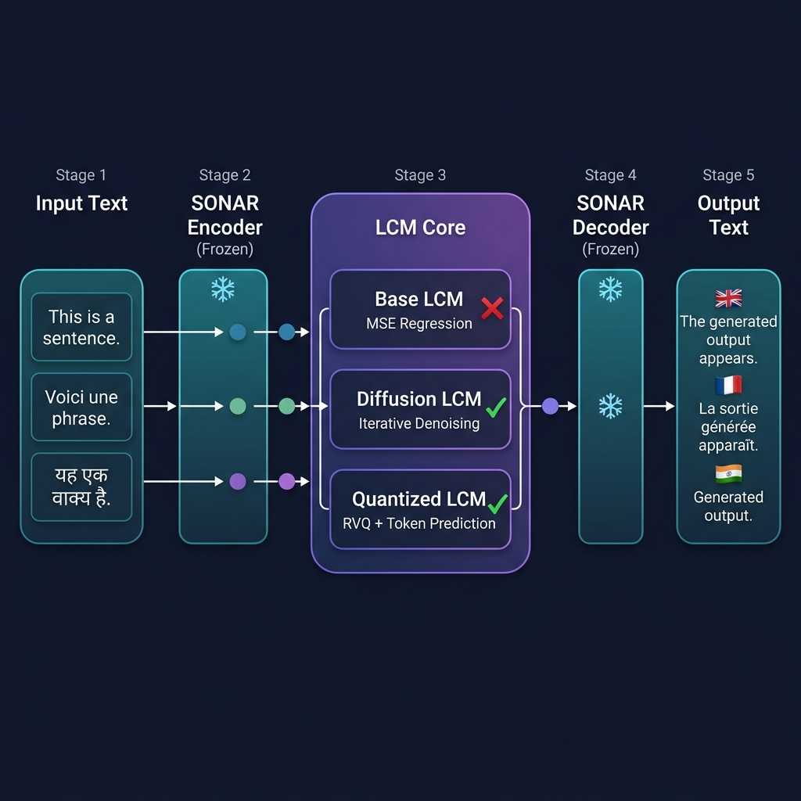
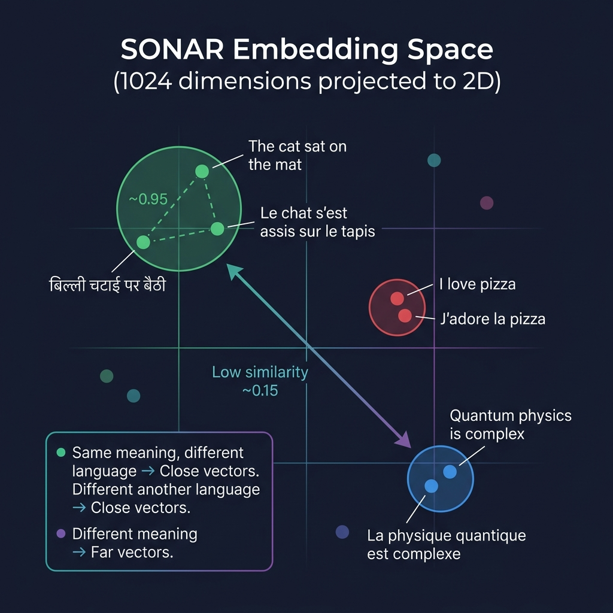
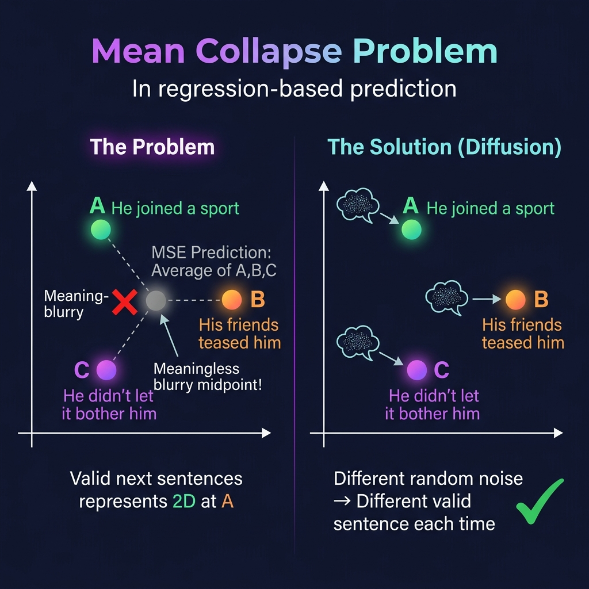
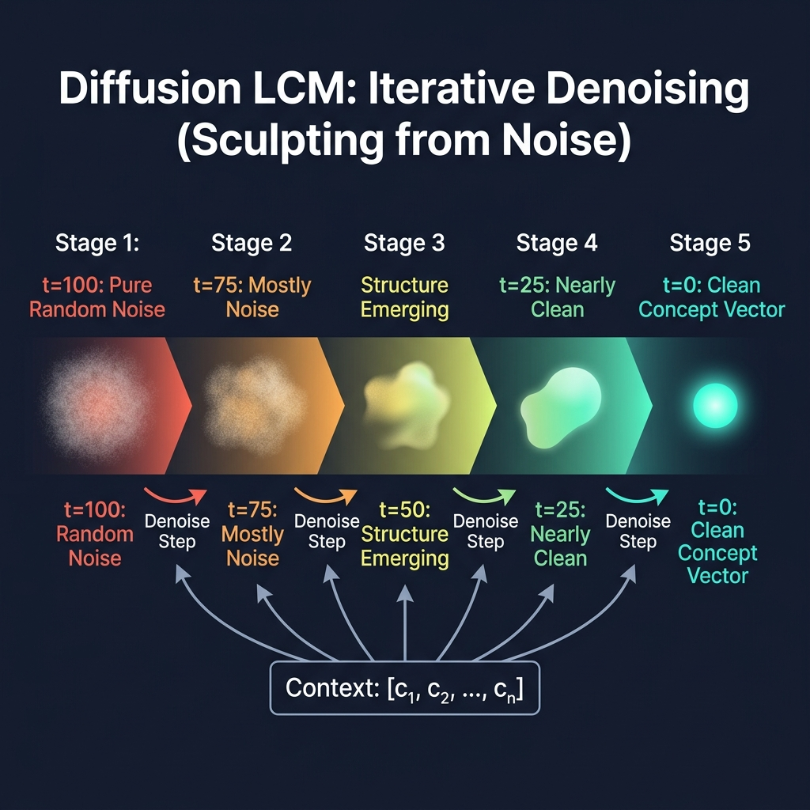
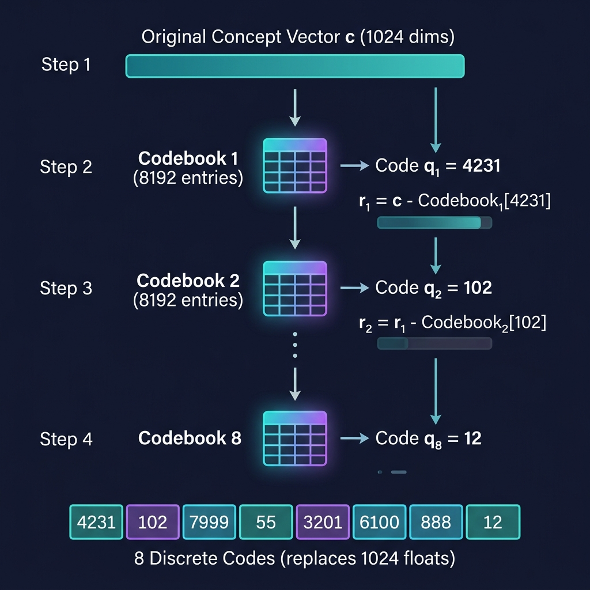

# Large Concept Models — Detailed Notes

> **Paper:** *Large Concept Models: Language Modeling in a Sentence Representation Space*
> **Authors:** Meta FAIR (Facebook AI Research)
> **Core Idea:** Replace token-level autoregressive generation with concept-level (sentence-level) generation in a continuous semantic embedding space.

---

## Phase 1: High-Level Mental Model

### 1.1 — The Problem with Token-Level LLMs

All mainstream Large Language Models (GPT-4, Claude, Llama 3, Gemini) share a fundamental architectural constraint: they operate strictly at the **token (subword) level**. When generating text, they predict one subword at a time in an autoregressive loop. This creates three critical limitations:

#### Limitation 1: Humans Don't Think in Tokens

When a human plans a 15-minute presentation, they don't memorize every word. They create an outline of **high-level ideas** or **concepts**:
- Talk about X
- Transition to Y
- Conclude with Z

The exact words may change every time, but the *flow of concepts* is stable. Current LLMs have no explicit mechanism for this kind of high-level planning — they just stumble forward one subword at a time.

#### Limitation 2: Quadratic Computational Complexity

The Self-Attention mechanism inside Transformers requires every token to compute an attention score against every other token. This produces an **N × N attention matrix**, making the cost scale as **O(N²)** with sequence length.

| Text Length | Tokens (~) | Attention Operations |
|-------------|-----------|---------------------|
| Short sentence | 10 | 100 |
| Paragraph | 100 | 10,000 |
| Long document | 10,000 | 100,000,000 (100M) |
| Book | 100,000 | 10,000,000,000 (10B) |

Increasing text length by 10× causes compute to increase by **100×**.

**How the LCM mitigates this:** By operating on sentences (concepts) instead of tokens, a 100,000-token book becomes ~5,000 concept vectors. Attention cost drops from 10 Billion to 25 Million — a **~400× reduction**.

#### Limitation 3: Language Dependence

Token-level knowledge is deeply entangled with the specific language. To make an English LLM speak French, you must feed it millions of French tokens. The "knowledge" itself isn't language-agnostic.

### 1.2 — The Proposed Solution: Large Concept Models (LCM)

The LCM operates in an explicit, higher-level **semantic representation space** instead of a discrete token space.



**The Pipeline:**

1. **Concept Unit:** A single sentence is defined as one "concept."
2. **SONAR Encoder (Frozen):** Takes a sentence in any of 200 languages (or speech in 76 languages) and compresses it into a single **1024-dimensional continuous vector**. This vector represents pure *meaning*, stripped of language.
3. **LCM Core (The Brain):** An autoregressive model that looks at a sequence of past concept vectors and **predicts the continuous vector of the next concept**.
4. **SONAR Decoder (Frozen):** Translates the predicted concept vector back into human-readable text in any target language.

**The UN Translator Analogy:**
- **LLM approach:** Hear an English word → translate to a Spanish word → hear the next English word → translate → repeat. (Word-by-word, language-entangled)
- **LCM approach:** Listen to the entire English sentence → form a pure, abstract "thought" (concept vector) → generate the next logical "thought" → speak that thought in English, Spanish, or Swahili. Reasoning happens in a language-independent "thought space."

---

## Phase 2: Core Methodology & Mathematics

### 2.1 — The Foundation: SONAR Embedding Space

Before the LCM brain can reason, it needs a "language of thought." This is the **SONAR** space.



**What is SONAR?**
SONAR is a pre-trained sentence encoder/decoder developed by Meta. It maps sentences from **200 languages (text) and 76 languages (speech)** into a single, shared vector space of **1024 dimensions**.

**Critical Property — Semantic Nearness:**
Two sentences with similar meanings will have vectors that are **close together** in this 1024-dimensional space, regardless of what language they are written in.

```python
import torch

# SONAR encodes these sentences into 1024-dim vectors:
vec_english = sonar_encoder.encode("The cat sat on the mat.")      # [1024]
vec_french  = sonar_encoder.encode("Le chat s'est assis sur le tapis.")  # [1024]
vec_random  = sonar_encoder.encode("Quantum physics is complex.")  # [1024]

# Cosine similarity (1.0 = identical meaning, 0.0 = unrelated)
sim_en_fr = torch.cosine_similarity(vec_english, vec_french, dim=0)
sim_en_rn = torch.cosine_similarity(vec_english, vec_random, dim=0)

print(f"English vs French (same meaning): {sim_en_fr:.4f}")  # ~0.95
print(f"English vs Random:                {sim_en_rn:.4f}")  # ~0.15
```

**Why "Frozen"?**
The SONAR encoder and decoder are **never trained** during LCM training. They are pre-trained and locked. This keeps the coordinate system stable — if the encoder kept shifting its coordinate system during training, the LCM would be learning a moving target (like studying geography while the continents drift).

---

### 2.2 — Approach #1: Base LCM (MSE Regression) — ❌ FAILS

This is the most intuitive, naive approach — and it fails spectacularly. Understanding *why* it fails is essential.

**Architecture:**
A standard **Pre-Layer-Norm Transformer** (same family as GPT), but instead of a vocabulary softmax head over 50,000 tokens, it has a **linear projection head** that directly outputs a 1024-dimensional vector.

**Training Objective:**
Given a sequence of concept vectors $[c_1, c_2, ..., c_n]$, predict the next concept $c_{i+1}$ given all previous concepts $[c_1, ..., c_i]$.

**Loss Function — Mean Squared Error (MSE):**

$$L_{MSE} = \frac{1}{1024} \sum_{j=1}^{1024} \left(c_{i+1}^{(j)} - \hat{c}_{i+1}^{(j)}\right)^2$$

**Analogy:** MSE training is like telling a dart thrower: "Your score is the average distance from the bullseye." The thrower will always aim for the exact center — the safest, most average spot.

**PyTorch Implementation:**

```python
import torch
import torch.nn as nn

class BaseLCM(nn.Module):
    def __init__(self, d_model=1024, n_heads=16, n_layers=26):
        super().__init__()
        encoder_layer = nn.TransformerEncoderLayer(
            d_model=d_model,
            nhead=n_heads,
            dim_feedforward=4096,
            norm_first=True,       # Pre-LayerNorm
            batch_first=True
        )
        self.transformer = nn.TransformerEncoder(encoder_layer, num_layers=n_layers)
        self.output_head = nn.Linear(d_model, d_model)
    
    def forward(self, concept_sequence):
        """
        concept_sequence: [batch, seq_len, 1024]
        Returns: predicted next concept [batch, seq_len, 1024]
        """
        seq_len = concept_sequence.size(1)
        causal_mask = nn.Transformer.generate_square_subsequent_mask(seq_len)
        hidden = self.transformer(concept_sequence, mask=causal_mask)
        return self.output_head(hidden)

# --- Training ---
model = BaseLCM()
optimizer = torch.optim.AdamW(model.parameters(), lr=1e-4)
loss_fn = nn.MSELoss()

concepts = torch.randn(8, 20, 1024)  # 8 docs, 20 sentences each
input_concepts  = concepts[:, :-1, :]   # [8, 19, 1024]
target_concepts = concepts[:, 1:, :]    # [8, 19, 1024]

predicted = model(input_concepts)
loss = loss_fn(predicted, target_concepts)
loss.backward()
optimizer.step()
```

#### 💀 The Fatal Flaw: Mean Collapse



After the sentence *"Tim wasn't very athletic"*, there are **many** valid next sentences:
- **A:** *"He thought that would change if he joined a sport."* → Vector at `[0.6, -1.0, 0.9]`
- **B:** *"His friends often teased him about it."* → Vector at `[0.2, 0.5, -0.3]`
- **C:** *"But he didn't let it bother him."* → Vector at `[-0.4, 0.8, 0.1]`

MSE punishes the model equally for being far from any of these valid options. The mathematically optimal strategy is to predict the **arithmetic average**:

$$\hat{c} = \frac{A + B + C}{3} = \frac{[0.6, -1.0, 0.9] + [0.2, 0.5, -0.3] + [-0.4, 0.8, 0.1]}{3} = [0.133, 0.1, 0.233]$$

**This averaged vector doesn't correspond to ANY meaningful sentence.** It's a blurry midpoint in semantic space — like mixing red, blue, and green paint and getting a muddy brown nobody wanted.

The result: the Base LCM produces **generic, bland, non-committal sentences** that are vaguely on-topic but never say anything specific.

---

### 2.3 — Approach #2: Diffusion-Based LCM — ✅ THE WINNER

This is the paper's star contribution. To fix mean collapse, they borrow the core mechanic from **AI image generators** (Stable Diffusion, DALL-E) and apply it to sentence vectors.



**Core Intuition:**
Instead of predicting the next concept vector in one shot, the Diffusion LCM starts with **pure random noise** and *gradually sculpts it* into a meaningful concept vector over many small, iterative denoising steps.

**Sculptor Analogy:**
- **MSE approach:** Ask the sculptor to instantly teleport clay into a finished statue in one motion → produces something average and ugly.
- **Diffusion approach:** Hand the sculptor a rough block of marble and let them chip away across 100 tiny, careful strokes. Each stroke removes noise. After 100 strokes, a beautiful, specific statue emerges.

#### The Mathematics

**Forward Process (Adding Noise during training):**

Take a known target concept vector $c_{i+1}$ and progressively corrupt it with Gaussian noise:

$$c_{i+1}^{(t)} = \alpha_t \cdot c_{i+1} + \sigma_t \cdot \epsilon, \quad \epsilon \sim \mathcal{N}(0, I)$$

Where:
- $t$ = noise level (timestep), from 0 (clean) to $T$ (pure noise)
- $\alpha_t$ = signal-preservation coefficient (starts high → shrinks toward 0)
- $\sigma_t$ = noise coefficient (starts at 0 → grows toward 1)
- $\epsilon$ = pure random Gaussian noise
- Schedule constraint: $\alpha_t^2 + \sigma_t^2 = 1$ (variance-preserving)

**Reverse Process (Denoising during inference):**

Start with pure noise $c^{(T)} \sim \mathcal{N}(0, I)$ and iteratively denoise:

$$c^{(t-1)} = \frac{1}{\alpha_t}\left(c^{(t)} - \frac{\sigma_t^2}{\sigma_t} \epsilon_\theta(c^{(t)}, t, \text{context})\right) + \sigma_t \cdot z$$

The neural network $\epsilon_\theta$ learns to predict the noise that was added, given:
1. The noisy vector $c^{(t)}$
2. The current timestep $t$
3. The context — all previously generated concept vectors $[c_1, ..., c_i]$

#### PyTorch Implementation

```python
import torch
import torch.nn as nn

class DiffusionLCM(nn.Module):
    def __init__(self, d_model=1024, n_heads=16, n_layers=26, T=100):
        super().__init__()
        self.T = T

        # Context Encoder — processes past concept vectors
        context_layer = nn.TransformerEncoderLayer(
            d_model=d_model, nhead=n_heads,
            dim_feedforward=4096, norm_first=True, batch_first=True
        )
        self.context_encoder = nn.TransformerEncoder(context_layer, num_layers=n_layers)

        # Denoising Network — the "sculptor"
        self.noise_predictor = nn.Sequential(
            nn.Linear(d_model * 2 + 128, 4096),
            nn.GELU(),
            nn.Linear(4096, 4096),
            nn.GELU(),
            nn.Linear(4096, d_model)
        )

        # Timestep embedding
        self.time_embed = nn.Sequential(
            nn.Linear(1, 128), nn.GELU(), nn.Linear(128, 128)
        )

        # Noise schedule
        betas = torch.linspace(1e-4, 0.02, T)
        alphas = 1.0 - betas
        alphas_cumprod = torch.cumprod(alphas, dim=0)
        self.register_buffer('sqrt_alphas_cumprod', torch.sqrt(alphas_cumprod))
        self.register_buffer('sqrt_one_minus_alphas_cumprod', torch.sqrt(1 - alphas_cumprod))
        self.register_buffer('betas', betas)
        self.register_buffer('alphas', alphas)

    def forward_diffusion(self, c_target, t):
        """Add noise to the target concept (training time)."""
        noise = torch.randn_like(c_target)
        alpha_t = self.sqrt_alphas_cumprod[t].unsqueeze(-1)
        sigma_t = self.sqrt_one_minus_alphas_cumprod[t].unsqueeze(-1)
        c_noisy = alpha_t * c_target + sigma_t * noise
        return c_noisy, noise

    def predict_noise(self, c_noisy, t, context_vectors):
        """Predict the noise that was added, conditioned on context."""
        context_encoded = self.context_encoder(context_vectors)
        context_summary = context_encoded[:, -1, :]
        t_emb = self.time_embed(t.float().unsqueeze(-1) / self.T)
        combined = torch.cat([c_noisy, context_summary, t_emb], dim=-1)
        return self.noise_predictor(combined)

    @torch.no_grad()
    def generate_next_concept(self, context_vectors, num_steps=100):
        """Inference: sculpt from pure noise to a clean concept vector."""
        batch_size = context_vectors.size(0)
        c = torch.randn(batch_size, 1024, device=context_vectors.device)

        for t in reversed(range(num_steps)):
            t_tensor = torch.full((batch_size,), t, device=c.device, dtype=torch.long)
            predicted_noise = self.predict_noise(c, t_tensor, context_vectors)
            alpha_t = self.alphas[t]
            beta_t = self.betas[t]
            sigma_t = self.sqrt_one_minus_alphas_cumprod[t]
            c = (1 / torch.sqrt(alpha_t)) * (c - (beta_t / sigma_t) * predicted_noise)
            if t > 0:
                c = c + torch.sqrt(beta_t) * torch.randn_like(c)
        return c

# --- Training ---
model = DiffusionLCM()
optimizer = torch.optim.AdamW(model.parameters(), lr=1e-4)

context = torch.randn(8, 15, 1024)  # 15 past concepts
target = torch.randn(8, 1024)       # ground-truth next concept
t = torch.randint(0, 100, (8,))     # random timestep per example

c_noisy, true_noise = model.forward_diffusion(target, t)
predicted_noise = model.predict_noise(c_noisy, t, context)
loss = nn.MSELoss()(predicted_noise, true_noise)
loss.backward()
optimizer.step()
```

#### Why Diffusion Fixes Mean Collapse

The diffusion model learns the **entire probability distribution** of valid next concepts, not a single point estimate. Each inference run starts from *different random noise*, so the denoising path converges to a **different but equally valid** next sentence:

- **Run 1:** Random noise sculpts → *"He thought that would change if he joined a sport."*
- **Run 2:** Different noise sculpts → *"His friends often teased him about it."*
- **Run 3:** Different noise sculpts → *"But he didn't let it bother him."*

Each output is specific and meaningful — no mushy averages.

---

### 2.4 — Approach #3: Quantized LCM (QLCM) — ✅ ALSO WORKS

Instead of operating on continuous vectors (hard for Transformers), this approach **discretizes** the SONAR vectors using **Residual Vector Quantization (RVQ)**.



**Intuition:** Convert a high-resolution photograph (continuous pixel values) into a mosaic of colored tiles (discrete codes). You lose some fine detail, but now you can use standard next-token prediction.

#### How RVQ Works (Step-by-Step)

1. Take a continuous concept vector $c \in \mathbb{R}^{1024}$
2. Find nearest match in Codebook 1 (8,192 prototypes) → record index $q_1$
3. Compute residual: $r_1 = c - \text{Codebook}_1[q_1]$
4. Find nearest match in Codebook 2 for the residual → record index $q_2$
5. Compute residual: $r_2 = r_1 - \text{Codebook}_2[q_2]$
6. Repeat for $K = 8$ codebooks

**Result:** Each concept is represented as 8 integer codes: `[4231, 102, 7999, 55, 3201, 6100, 888, 12]`

```python
class ResidualVectorQuantizer:
    def __init__(self, n_codebooks=8, codebook_size=8192, dim=1024):
        self.n_codebooks = n_codebooks
        self.codebooks = [torch.randn(codebook_size, dim) for _ in range(n_codebooks)]

    def quantize(self, c):
        """c: [1024] → returns list of 8 integer codes"""
        codes = []
        residual = c.clone()
        for i in range(self.n_codebooks):
            distances = torch.cdist(residual.unsqueeze(0), self.codebooks[i])
            nearest_idx = distances.argmin(dim=-1).item()
            codes.append(nearest_idx)
            residual = residual - self.codebooks[i][nearest_idx]
        return codes  # e.g., [4231, 102, 7999, 55, 3201, 6100, 888, 12]

    def dequantize(self, codes):
        """Reconstruct the vector from codes (lossy!)"""
        reconstructed = torch.zeros(1024)
        for i, code in enumerate(codes):
            reconstructed += self.codebooks[i][code]
        return reconstructed
```

#### Two QLCM Variants

| Variant | Architecture | How it works |
|---------|-------------|-------------|
| **One-Tower** | Single Transformer | Interleaves context concept tokens and quantized codes in one long sequence |
| **Two-Tower** | Two separate Transformers | Tower 1 encodes context concepts; Tower 2 autoregressively generates the 8 RVQ codes conditioned on Tower 1's output |

---

### 2.5 — Computational Complexity Comparison

| Model | Sequence Length for N sentences | Attention Cost | Inference Steps per Concept |
|-------|--------------------------------|----------------|-----------------------------|
| Token-level LLM | ~20N tokens | O(400N²) | ~20 (one per token) |
| Base LCM (MSE) | N concept vectors | O(N²) | 1 (single forward pass) |
| Diffusion LCM | N concept vectors | O(N²) per denoise step | ~100 (denoising steps) |
| QLCM (Two-Tower) | N concepts + 8 codes | O(N²) + O(64) | 8 (one per RVQ code) |

**VRAM Estimate:** The paper's flagship Diffusion LCM has **1.6B parameters**. At FP16 precision: ~3.2 GB VRAM for weights — feasible on a single consumer GPU.

---

### 2.6 — Phase 2 Key Takeaways

1. **SONAR** is the frozen "language of thought" — a 1024-dim space encoding meaning from 200 languages.
2. **Base LCM** tried MSE regression and failed due to **mean collapse** (averaging over valid next sentences produces meaningless vectors).
3. **Diffusion LCM** (the star contribution) fixes this by learning the full distribution of valid next concepts via iterative denoising from random noise.
4. **Quantized LCM** offers an alternative by converting continuous vectors to discrete codes and using standard next-token prediction.

---

> **Status:** Phases 1–2 complete. Phases 3–7 pending.
